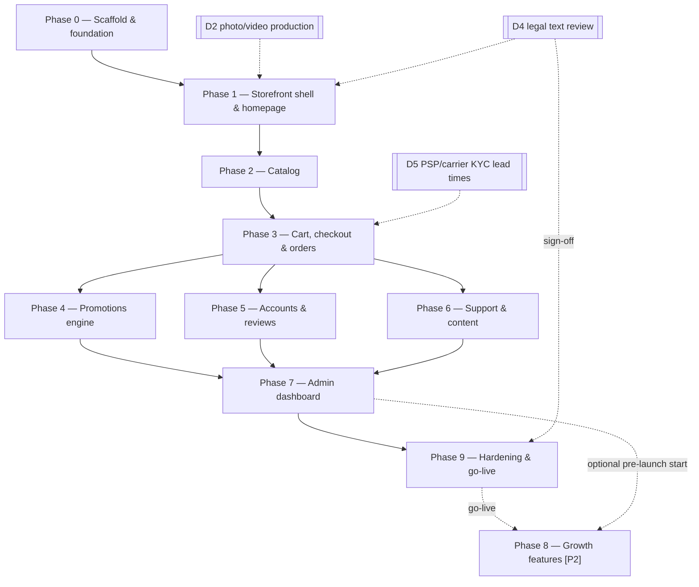

# Nasmeh.si — GENERAL PLAN OF EVERYTHING

**Version:** 2.3 · **Date:** 2026-09-15 · **Status:** Phases 0–2 and 4 complete; Phase 3 repaired locally with real-provider acceptance outstanding (gate G1); Phase 5 locally accepted; Phase 6 locally accepted; Phase 7 locally accepted; Phase 9 steps 1–4 complete locally (the D4 sign-off is external), step 5 next
**Grounding documents (do not contradict):** `AGENTS.md` (decided architecture), `docs/NASMEH_FEATURES.md` (feature spec, cited below as "§N"), `docs/HISMILE_FEATURES.md`, `docs/research/01–07`.

## 0. Status ledger

One row per phase. The linked record is the only evidence that counts (rule 11). Counts come from the most recent record for that phase and are not re-run by this document.

| Phase | Status | Evidence | Open items |
|---|---|---|---|
| 0 Scaffold | complete | [plan](plans/phase-0.md), review-boss section | — |
| 1 Shell, homepage, CMP | complete | [plan](plans/phase-1.md) | D2 hero media and D4 legal review are launch gates |
| 2 Catalog | complete | [plan](plans/phase-2.md) | sitemap omits catalog/product URLs (backlog B1) |
| 3 Cart, checkout, orders | repaired locally: 319 unit / 80 browser at repair time | [repairs](testing/phase-3-repairs-2026-09-09.md), [audit](testing/phase-3-audit-2026-09-09.md) | **G1** real Stripe/PayPal/Turnstile sandbox acceptance not executed ([checklist](testing/phase-3-sandbox-checklist.md)); Klarna SI eligibility unconfirmed |
| 4 Promotions | complete | [plan](plans/phase-4.md) | — |
| 5 Accounts, reviews | locally accepted: 512 unit / 94 browser | [acceptance](testing/phase-5-acceptance-2026-09-09.md) | host scheduling of `/api/jobs/daily` (G3) |
| 6 Support, content | locally accepted: 682 unit / 111 browser at step 6; Docker build and run smoke pass | [step 1](testing/phase-6-step-1-2026-09-09.md), [step 2](testing/phase-6-step-2-2026-09-09.md), [step 3](testing/phase-6-step-3-2026-09-09.md), [step 4](testing/phase-6-step-4-2026-09-10.md), [step 5](testing/phase-6-step-5-2026-09-10.md), [step 6](testing/phase-6-step-6-2026-09-10.md), [build-verify run](testing/build-verify-2026-09-09.md) | mailboxes and hours (G2), host cron for the five daily streams (G3), company data (G4), IRPS provider and legal review (D4) |
| 7 Admin | locally accepted: 862 unit / 127 browser at step 7; Docker build and run smoke pass; review-boss pass clean after four fixes | [plan](plans/phase-7.md), [step 1](testing/phase-7-step-1-2026-09-10.md), [step 2](testing/phase-7-step-2-2026-09-10.md), [step 3](testing/phase-7-step-3-2026-09-10.md), [step 4](testing/phase-7-step-4-2026-09-10.md), [step 5](testing/phase-7-step-5-2026-09-11.md), [step 6](testing/phase-7-step-6-2026-09-11.md), [step 7](testing/phase-7-step-7-2026-09-11.md) | dashboard KPIs for sessions/conversion wait for Phase 8 analytics; real Stripe/PayPal refunds are part of gate G1; maintenance password hashing (B15) in Phase 9 |
| 9 Hardening, go-live | steps 1–4 complete locally: 1240 unit / 148 browser at step 4; Docker build and run smoke pass at step 1; Lighthouse desktop 100 on the four templates, mobile 97–98 (product-page LCP 2.53 s against 2.5 s, deviation recorded); backup + restore drill and forced-failure alert passed on the production compose shape; step 4: legal checklist with the 303-question register, consent-log audit, legal-acceptance and invoice snapshots per order, consent log with one write path, double opt-in by POST, GDPR export and anonymisation, retention job, Omnibus anchored at the announced reduction, claims copy; the upgrade-path check of the data migrations passes; the D4 sign-off is external; step 5 next | [plan](plans/phase-9.md), [step 1](testing/phase-9-step-1-2026-09-12.md), [step 2](testing/phase-9-step-2-2026-09-12.md), [step 3](testing/phase-9-step-3-2026-09-12.md), [step 4](testing/phase-9-step-4-2026-09-15.md), [legal checklist](testing/legal-checklist.md), [runbook](RUNBOOK.md) | CSP report-only until real traffic stays clean; backups are host-local until the host's off-site storage is chosen (step 5), and the uptime checker product is still a placeholder (step 5); D4 (lawyer, accountant, responsible person, IRPS provider), G2 mailboxes and G4 company data stay open, with the owner decisions listed in the checklist (D7 capture, GTM gating, retention periods); steps 5–6 wait on the host (G3) and D5/G1; no major framework upgrade before launch (11 advisories dispositioned in the step 1 record) |
| 8 Growth [P2] | post-launch | — | — |

**Repository state note (2026-09-09 code analysis):** the analysed working folder is a snapshot without `.git`, `node_modules`, `.env` or a build, on a machine without Node, Docker or Git. The "committed / uncommitted" statements in older phase records could not be verified from it; treat the folder contents as the working tree at the step 2 checkpoint (gate G5). No gate can run until §2.1 holds (gate G0). Local test mode and Mailpit never certify real provider behaviour or launch readiness. v1.1 changes are listed in §7.

This plan sequences the entire build into **Phases 0–9**. Every phase runs the mandated loop:

> **(a)** write/refine a phase implementation plan (`docs/plans/phase-N.md`) → **(b)** execute → **(c)** test thoroughly: `npm run lint`, `npm run test` (Vitest), `npm run test:e2e` (Playwright), manual checklist, and a clean `docker compose build && docker compose up -d` smoke test → **(d)** fix every bug found → **(e)** pass the review-boss gate, only then start the next phase.

---

## 1. How the plan maps to the spec

- Spec phase tags (`[P1-core]` / `[P2-growth]` / `[P3-later]`, §1.1) are **law**. Plan Phases 0–7 + 9 deliver everything `[P1-core]` before launch. Plan Phase 8 = `[P2-growth]`. `[P3-later]` is out of scope for this plan except where explicitly flagged.
- Where a `[P2]` capability needs **data-model readiness** at P1 (deal SKUs, FreeGiftRule, BXGY coupon type), the schema carries it from Phase 0 (AGENTS.md §4) but **no UI or logic** is built early. Such items are marked `[P2 — model only here]`.
- Two intentional ordering decisions, called out so nobody "fixes" them later:
  1. **The checkout discount field and `/koda/{CODE}` redemption go live in Phase 4**, not Phase 3. Phase 3 builds the pure pricing core of `lib/promo` (lines, bundles, shipping, VAT) because cart totals need it; Phase 4 extends the *same* engine with coupons and only then enables the discount UI (§7.2, §8.2). We never ship a visible discount field backed by ad-hoc math.
  2. **Phase 9 (hardening & go-live) may start right after Phase 7** and go-live may precede Phase 8 — the spec defines P2 features as *post-launch* growth levers (§1.1, §16). Recommended real-world order: `0→1→2→3→4→5→6→7→9 (go-live) →8`. Phase numbering is kept as mandated; the gate is documented in Phase 9.

## 2. Cross-phase rules (apply to every phase)

1. **Phase discipline.** Build nothing from a later spec phase early (AGENTS.md §1). If a phase below lists a `[P2]`/`[P3]` item, it is marked and is either model-only or explicitly deferred.
2. **Test gates are blocking** (AGENTS.md §7): `lint` + `test` + `test:e2e` green **and** a production `docker compose build` succeeding from a clean checkout **and** the phase's manual checklist completed. A phase is not done while anything is red.
3. **Review-boss pass at the end of every phase.** A strict review against: AGENTS.md §8 conventions (all 12), SSR/a11y spot-check (content in initial HTML, JS disabled), money-always-server-side spot-check, admin role re-check spot-check, phase-discipline check, no-copied-HiSmile-assets check (§15). Findings are written into the phase plan doc; **all** are fixed before the next phase starts.
4. **Promo engine purity.** Any change to `lib/promo` ships with Vitest coverage in the same phase or it is not done (AGENTS.md §7, §8.4). The engine takes plain inputs + injected `now`; no I/O.
5. **Migrations.** Schema evolves only via `prisma migrate dev` locally + committed migrations; deploys run `migrate deploy` (AGENTS.md §6–7). Price changes always go through the shared PriceHistory helper (AGENTS.md §8.9).
6. **Config-driven merchandising.** Anything campaign-ish (marquee, thresholds, badges, hero, popup copy, pixel IDs) is `Setting`/admin data, never code (§2.3, AGENTS.md §5.8).
7. **Slovenian copy lives in `lib/copy/`** from the first component (AGENTS.md §8.5); money formatting only via `lib/pricing` (AGENTS.md §8.10).
8. **Never copy HiSmile assets** — names, copy lines, imagery, pink identity (§15, AGENTS.md §1).
9. **Every phase ends deployable.** `main` always builds a working Docker image; a broken build blocks everything.
10. **Checkpoint discipline (Phase 6 onward).** Each phase is split into numbered steps in its phase plan. Complete and verify one step, write its acceptance record (`docs/testing/phase-N-step-M-<date>.md`), update the status ledger (§0), then **stop and report** before the next step. A progress message is not a stop. *Direction of 2026-09-10:* the user asked for the remaining Phase 6 steps and the later phases to run in order without a stop between checkpoints; records, commits and ledger updates stay per step.
11. **Evidence over claims.** A phase or step is "green" only if a record under `docs/testing/` from the same run says so. Older "all gates green" lines inside phase plans are history, not status (the Phase 3 audit is the precedent). Never restate a count that the run being reported did not produce.
12. **Definition of ready.** Step (b) of any step starts only when §2.1 holds on the workstation, the step's migration is designed, and its external inputs are present or replaced by a documented placeholder (`.test` mailboxes, seeded templates, test drivers). Placeholders are listed in the step's plan section so Phase 9 can replace them.
13. **Shared write paths.** Money and inventory state have one write path each: prices → `lib/price-history` (exists); order payment states → `lib/orders/transitions` (exists), extended with shipped/delivered in Phase 6 step 3; stock increases → the restock-aware stock helper from Phase 6 step 5, while `deductOrderInventory` stays the single decrement path; money out → `lib/orders/refunds.ts` (Phase 7 step 2), which is the only code that calls a provider refund or raises `Order.refundedCents` outside the webhook handlers. Once a helper exists no other code writes that column; seed and tests go through the helper too.

### 2.1 Workstation prerequisites & bootstrap

The `package.json` scripts assume a POSIX shell, Docker Compose v2 and a fixed set of free local ports. Verify before any step (b):

| Need | Why | Check |
|---|---|---|
| Node.js 20 LTS + npm | the `Dockerfile` runner is `node:20-alpine`; `postinstall` runs `prisma generate` | `node --version` |
| Docker Desktop or Engine with Compose v2 | `db` (Postgres 16) and `mailpit` for `test:e2e`; the production image build gate | `docker compose version` |
| Git | migrations and seeds are committed per phase; acceptance records cite a commit | `git --version` |
| POSIX shell | `npm start` runs `scripts/start-standalone.sh` (links private media into the standalone dir); Playwright's `webServer` calls it | Git Bash or WSL on Windows (backlog B6 ports it to Node) |
| Playwright Chromium | `test:e2e` | `npx playwright install chromium` |
| Free ports 5543 (db), 11025/18025 (Mailpit SMTP/UI), 4317 (e2e server), 3000 (dev/preview) | fixed in `docker-compose.override.yml`, `.env.example`, `playwright.config.ts` | nothing else listening |
| Postgres reachable on **both** loopbacks (127.0.0.1 and ::1) when not using the compose `db` | `localhost` resolves to `::1` first on Windows; a non-listening `::1` costs ~2 s per new connection, which exhausts Prisma's 2 s transaction-start window under concurrency (found 2026-09-09). Docker publishes both families automatically. | `pg_isready -h ::1 -p 5543` |

Bootstrap from a clean checkout:

```bash
cp .env.example .env            # set AUTH_SECRET and JOBS_SECRET; leave PSP keys empty locally
npm ci                          # runs prisma generate
docker compose --profile tools up -d db mailpit --wait
npx prisma migrate deploy       # npm run prisma:migrate only when changing the schema
npm run db:seed                 # needs DATABASE_URL exported in the shell (B10): tsx does not read .env
npm run dev                     # http://localhost:3000 (Windows: first run may stop in predev, see B9; run again)
```

`npm run test:e2e` builds the production standalone server on port 4317, **seeds whatever `DATABASE_URL` points at**, and mutates that database. Point it at a disposable database; the acceptance records use `nasmeh_<phase>_<date>` names on port 5543. Never run it against a preview or production database.

## 3. Dependency overview



Phases 4, 5, 6 all depend only on Phase 3 and may be sequenced to taste; the mandated numbering (4→5→6) is the default. Phase 7 needs everything it administers (2–6) to exist.

---

## Phase 0 — Project scaffold & foundation

**Goal:** a clean checkout builds and runs in Docker; DB migrates and seeds; auth skeleton, design tokens, Ui primitives, copy system, and CI scripts exist. No user-facing features yet.
**Depends on:** nothing (first phase). Open decision D1 (brand color) should land before theming is finalized but is token-gated, so it cannot block.

**Scope:**
1. Repo init per AGENTS.md §3: Next.js 15 App Router + TypeScript strict; `app/(storefront)`, `app/admin`, `app/api`, `components/{storefront,admin}`, `lib/`, `prisma/`, `tests/{unit,e2e}`. Server Components by default (AGENTS.md §8.1).
2. Tailwind CSS v4 + design tokens: drop-in RGB-triplet custom properties from research 06 §19 — iOS-gray neutral ramp, ONE `--brand` token (final color = open decision D1; recommendation `#00A88F`; **no hex in components**, AGENTS.md §8.6), `--radius-btn: 3rem` / `--radius-card: .5rem` / `--radius-input: .25rem`, 20 px gutter (`--padding: 1.25rem`), breakpoints 768/991, hairline borders (§2.3).
3. Self-hosted free font stack (Plus Jakarta Sans / Figtree + chunky display face for campaign art, research 06 §3.3) with `font-display: swap` (§3.6).
4. Ui primitive library (components/storefront): `UiButton` (pill), `UiPill`/badge, `UiInput` + form-field wrapper, `UiModal`, `UiAccordion`, carousel + CSS-marquee primitives (research 06 §6–13) — keyboard-navigable, focus states, SSR-safe (AGENTS.md §8.11).
5. Copy-file system: `lib/copy/` keyed modules per surface; zero hardcoded Slovenian strings in components (AGENTS.md §8.5).
6. Prisma baseline schema (AGENTS.md §4) + initial migration: `User(role)`, `Product`, `Variant`, `PriceHistory`, `Collection`, `Order`, `OrderItem`, `Coupon`, `Promotion`/`FreeGiftRule` `[P2 — model only]`, `Bundle`, `Review`, `Cart`, `Address`, `Setting`, `ContentPage`, `Menu`, `ConsentLog`. Seed: 3 hero SKUs + routine bundle at spec prices (§2.1: €34.99 / €19.99 / €19.99 / bundle), `maxCartQuantity` defaults (5; bundles/gifts 1), one `ADMIN` user, baseline `Setting` rows (€45 free-shipping threshold §7.1, VAT 22 % §2.2, marquee text, menus).
7. Auth.js v5 skeleton: credentials provider (email + bcrypt password), one `User` model with `role: CUSTOMER | ADMIN`, session callbacks exposing role, middleware gating `/admin/*` (AGENTS.md §2, §5.7). No login UI yet.
8. `lib/pricing`: integer-cents money, VAT-inclusive formatting, `"vključen DDV 22 %: €X"` breakdown helper, `PriceHistory` write-helper (AGENTS.md §8.9–10) + Vitest unit tests.
9. Env validation with zod at boot (AGENTS.md §8.2); `.env.example` mirroring AGENTS.md §6 env table; secrets never in the image, never behind `NEXT_PUBLIC_`.
10. Docker: multi-stage `Dockerfile` (`node:20-alpine`, deps→build→standalone runner, non-root, `HEALTHCHECK` → `/api/health`), `docker-compose.yml` with `app` (`${PORT:-3000}:3000`) + `db` (`postgres:16-alpine`, named volume `pgdata`, not host-published) + optional `adminer`/`mailpit` under profile `tools`; entrypoint = `prisma migrate deploy && node server.js`; resource limits documented (AGENTS.md §6). `/api/health` route included.
11. Transactional email service: Nodemailer over SMTP + MJML/React-email template pipeline (AGENTS.md §2) — service + one proof template only; real templates land per-phase.
12. CI scripts (AGENTS.md §7): `dev`, `build`, `start`, `lint` (eslint + `tsc --noEmit`), `test` (Vitest), `test:e2e` (Playwright), `prisma:migrate`, `prisma:studio`, `db:seed`; Playwright configured against the dev server with Mailpit for email assertions.

**Deliverables:** runnable skeleton app rendering a token-themed placeholder homepage; working `docker compose up -d`; seeded DB; green CI scripts; `docs/plans/phase-0.md`.

**Test & acceptance (step c):**
- `npm run lint`, `npm run test`, `npm run test:e2e` (smoke: `GET /` 200, `/api/health` 200) all green.
- Clean clone → `docker compose build && docker compose up -d` → `/api/health` 200; migrations auto-applied; seed idempotent (running `db:seed` twice creates no duplicates).
- Unit: `€34.99` stored as `3499`; VAT-included breakdown at 22 % returns exact net/gross/tax cents; PriceHistory helper appends a row in the same transaction as a price update.
- Grep audit: no hex colors outside the token file; no Slovenian string literals in components; no secrets in repo.
- Manual: docker smoke checklist (container logs clean, non-root user, restart policy).

## Phase 1 — Storefront shell & homepage

**Goal:** the whole site chrome (marquee/header/footer/drawer), GDPR CMP, homepage per §4, legal-page rendering, and the SSR SEO foundation.
**Depends on:** Phase 0. External inputs: D2 (hero video/imagery — placeholders acceptable until production), D4 (legal texts — drafts acceptable, professional review gates launch, not this phase).

**Scope:**
1. Announcement marquee: brand-color, infinite CSS marquee, ONE clickable config-driven message from `Setting` (§3.1 [P1]). (Session code-swap variant is §3.1 [P2] → Phase 8.)
2. Sticky header block (§3.1, revised by user screenshot direction on 2026-09-09): shopping-focused promotion/account rows with Prijava/Moj račun; Nasmeh logo, "TRGOVINA" mega-menu (product links + two landscape Nasmeh featured-product media cards with titles above images), highlighted "PAKETI & PRIHRANKI" linking to `/trgovina?kolekcija=paketi`, search and cart count. No Help Centre, About Us or Explore destinations. Keep Nasmeh's own teal tokens, copy and assets; the screenshot is a layout reference. Mobile: hamburger + centered logo + search/cart; drawer mirrors the simplified shopping links and featured cards. Menus remain `Menu` data (admin CRUD in Phase 7); hover mini-preview is §3.1 [P2] → Phase 8. Phase 6 step 2 applies this revision to the existing chrome.
3. Footer (§3.2): email-capture block with trial-exclusivity hook → double opt-in flow (capture → verification email via Phase 0 mailer → confirmed subscriber + consent history; §13.1 [P1]); shopping, contact/support, tracking, legal and social link groups (accordions on mobile), retaining `/kontakt` and `/sledi`; payment icon row (Visa, MC, PayPal, Apple Pay, Google Pay, Klarna); company identification block (name, address, reg. no., VAT ID, email); legal links incl. "Nastavitve piškotkov" reopening the CMP. Remove Help Centre, About Us, Explore and standalone Delivery links under the revised page scope.
4. GDPR CMP (§3.4 [P1]): first-visit granular banner (Nujni/Analitični/Trženjski toggles; Sprejmi vse / Zavrni / Shrani izbiro); consent persisted in cookie **and** server-side `ConsentLog` (timestamp, version, choices); script gating — zero analytics/marketing tags before consent, Google Consent Mode v2 defaults passed; re-openable from footer; cookie-policy page with live cookie table (name/provider/purpose/duration). (Consent versioning re-ask is [P2] → Phase 8.)
5. Homepage sections in spec order (§4): (1) hero product-launch slot — split layout, autoplay muted loop video with separate mobile/desktop crops + poster, optional promo overlay banner, fully `Setting`-driven content slot (§14.10 admin in Phase 7); (2) "Naše uspešnice" rail — 3 heroes + bundle cards with badge pills and star-rating slot (ratings render once reviews exist in Phase 5; ATC buttons activate in Phase 3 — until then they link to PDP); (3) bundle banner (brand-color block); (4) full-width clickable routine-bundle banner with legal footnote as **live HTML text under the image**; (8) footer. Deliberately absent: quiz, press bar, blog feed (§4). Homepage review strip / education strip / before-after gallery are §4 [P2] → Phase 8.
6. `ContentPage` rendering: `/[slug]` route, template system (default + legal), seed legal pages (Pogoji poslovanja, Politika zasebnosti, Politika piškotkov, Odstop od pogodbe, Reklamacije — §12.5) with reviewed-status flag in admin data; professional review tracked as D4. The original Dostava placeholder and the Help Centre/About Us/Explore destinations are retired in revised Phase 6 step 2 per the user's 2026-09-09 direction. Generic CMS capacity does not require these pages.
7. SEO foundation (§3.3 [P1]): SSR everywhere (copy in initial HTML); per-page SEO fields (title template `{Page} | Nasmeh.si`, hand-written meta descriptions, canonical, noindex); sitewide JSON-LD Organization + WebSite(+SearchAction); `noindex` on /cart, /checkout, /racun, /iskanje; auto `sitemap.xml` + `robots.txt`; OG + Twitter cards with 1200×628 default image; GSC verification file/meta support.
8. Global UX (§3.6 [P1]): 404 page with copy + auto-redirect countdown; maintenance/password mode flag; skeleton loaders + lazy sections via IntersectionObserver.
9. Bot protection (§3.6 [P1]): Cloudflare Turnstile (or hCaptcha — pick in phase plan) wired as a reusable server-verified form guard; applied to newsletter capture now, all later forms reuse it.

**Deliverables:** full chrome + homepage live from data; CMP with server consent log; legal pages rendering; sitemap/robots/JSON-LD; `docs/plans/phase-1.md`.

**Test & acceptance (step c):**
- View-source audit (JS disabled): marquee, nav, mega-menu, footer, all homepage copy present in initial HTML; JSON-LD valid (Rich Results Test) for Organization/WebSite.
- CMP e2e: first visit shows banner; rejecting all → no marketing script tags in DOM and no requests fire; accepting analytics → only analytics fires; choice row appears in `ConsentLog`; footer link reopens banner; cookie table page renders.
- Newsletter e2e: submit → verification email in Mailpit → confirm → subscriber marked double-opted-in; Turnstile token verified server-side (mocked in test).
- Mega-menu/drawer keyboard navigation e2e; mobile drawer contains featured cards + colored link.
- Maintenance mode on → password gate; off → site. 404 renders + countdown.
- `sitemap.xml` lists homepage/legal pages; `robots.txt` reachable; lint/unit/e2e green; docker smoke.

## Phase 2 — Catalog

**Goal:** `/trgovina`, PDPs for 3 heroes + bundle, site search, breadcrumbs, Omnibus price display, per-page SEO — all server-rendered.
**Depends on:** Phase 1 (chrome + SEO base). External: D2 packshots/gallery assets (placeholders acceptable).

**Scope:**
1. `/trgovina` all-products page (§5 [P1]): full-width promo banner (separate mobile crop); collection tabs (Vsi izdelki / Beljenje / Paketi) as deep-linkable handles; sort dropdown (Priporočeno / Najnovejše / Cena ↑ / Cena ↓ / Naziv A–Ž / Ž–A) with sort in the URL; **no facet filters** (deliberate, §5/§15); SEO text block below grid with "Preberi več +" expander; lazy grid + skeletons.
2. Product card anatomy (§5): promo pill badge → packshot on light tile → title → star rating + count (renders from `Review` aggregates; empty until Phase 5, component ships now) → VAT-incl. price with Omnibus-compliant compare-at when discounted → unit price where relevant ("(€2,50 na uporabo)") → variant swatches with "+N" → full-width CTA by state: "Dodaj v košarico" (activates Phase 3) / "Sestavi paket" / "Obvestite me" (sold out).
3. Badge system (§5): admin-data-driven NOVO (outline), Uspešnica, Hitro se prodaja, Razprodano (grey), promo pill. (Image sticker overlays, double-wide cards: §5 [P2] → Phase 8.)
4. Sold-out handling (§5, §6 [P1]): products stay published; "Obvestite me" capture on card + PDP → stored subscription (double opt-in via Phase 1 flow; **alert sending completes in Phase 6**).
5. PDP template (§6, DOM order 1–15, [P1]): breadcrumbs; portrait gallery (0.6875:1, stacked mobile scroll, first image `fetchpriority=high`; gunk-demo video is [P2]); badge pill + H1; rating summary (slot as above); USP chips row (max 3); intro + 3–4 checkmark bullets; accordion set #1 (Kako deluje · Sestavine INCI · Jamstvo vračila denarja · Testirano za rezultate) with **server-rendered bodies** and `*`/`^` claims resolving to substantiation accordions (§12.6); buy box (VAT-incl. price, Omnibus 30-day-low line when discounted, unit-price anchor, Klarna line "ali 3 obroka po €X s Klarna", qty stepper 1–5 with minus disabled at 1, ATC — activates Phase 3, green 30-day guarantee pill); delivery & returns accordion (dostava 2–4 dni, brezplačna nad €45, 14-dnevni odstop — §6.9); cross-sell "Dopolni svojo rutino" (curated cards; quick-ATC activates Phase 3); per-product education sections (§6.11: serum color-wheel honesty, mouthwash visible-gunk, strips 3-step/30-min protocol); FAQ accordions + FAQPage JSON-LD; reviews section mount point (full build Phase 5); "Ljudje tudi kupujejo" 4-card row; sticky bottom buy bar. Per-product content checklist fields (§6) populated via `customFields` metafields pattern (AGENTS.md §4).
6. Fixed-bundle PDP: component list display, auto-computed savings line ("vrednost €Y — prihranite Z %") Omnibus-checked (§14.6 [P1]); deal-pack value-math anchoring is §9.2 [P2].
7. Omnibus price display (§9.2 [P1], AGENTS.md §5.6): `lib/pricing` helper computing lowest price in previous ≥30 days from `PriceHistory`; "Najnižja cena v 30 dneh pred znižanjem: €X" (window: the 30 days before the announced reduction, compare-at switched on with the price change or within 24 h) rendered automatically wherever a reduction is announced (cards, PDP, cart later).
8. Site search (§3.1 [P1]): header icon → full-width overlay; instant product results as you type (Route Handler, Postgres ILIKE/trigram over title/description/customFields); `/iskanje` all-results page (SSR, noindex). (Typo tolerance, synonyms, analytics: §3.1 [P2] → Phase 8.)
9. Per-page SEO (§3.3): Product/Offer JSON-LD (AggregateRating added in Phase 5), BreadcrumbList JSON-LD, canonical, per-product meta/OG from admin fields.

**Deliverables:** `/trgovina` + 4 PDPs live from DB; working instant search; Omnibus helper + tests; `docs/plans/phase-2.md`.

**Test & acceptance (step c):**
- View-source audit (JS disabled): PDP H1, price, accordion bodies, FAQ, breadcrumbs, JSON-LD (Product+Offer+FAQPage+BreadcrumbList) all in initial HTML; Rich Results Test passes.
- Unit: Omnibus helper — no history → no line; discount with 30-day-low → exact lowest price; price older than 30 days excluded. Unit-price helper €34.99/14 → "€2,50 na uporabo".
- e2e: /trgovina → tab switch (URL changes, deep-linkable) → each sort option orders correctly → PDP → gallery → accordions open/close → FAQ JSON-LD present; sold-out seeded product shows "Obvestite me" and accepts email capture.
- e2e search: typing "trak" suggests strips; overlay → results page; zero-result state.
- Bundle PDP shows components + correct savings math vs summed individual prices.
- lint/unit/e2e green; docker smoke.

## Phase 3 — Cart, checkout & orders

**Goal:** revenue path end-to-end: signed guest cookie cart + DB cart + merge, `/cart` page, one-page checkout, Stripe (cards/Apple Pay/Google Pay/Klarna) + PayPal, webhook-driven order statuses, confirmation + transactional emails, invoices, stock decrement, guest order lookup.
**Depends on:** Phase 2 (catalog to buy). External: D5 sandbox credentials for Stripe/PayPal(/Klarna) must exist before step (b) of this phase.
**Status (2026-09-09):** implemented and repaired locally with the test driver; **not accepted** until gate G1 (§4.1), the real-provider [sandbox checklist](testing/phase-3-sandbox-checklist.md), is executed and recorded. G1 has no code dependency on Phases 6–7 and should run as soon as D5 sandbox keys exist.

**Scope:**
1. Cart domain (AGENTS.md §5.2–5.4, §7): guest cart in **HMAC-signed cookie**; DB `Cart` for logged-in users; **merge-on-login** with `maxCartQuantity` re-applied; Server Actions `add/update/remove` with zod-validated intent (variant id + qty only — never prices); all totals computed server-side.
2. `lib/promo` **pricing core** (pure, `now` injected): `(lines, settings) → pricedCart` — line pricing from variant snapshots, fixed-bundle pricing + component expansion, subtotal, shipping cost with free-threshold logic (€45 from `Setting`), VAT breakdown, total. Full Vitest matrix. (Coupons extend this engine in Phase 4 — no ad-hoc discount math anywhere.)
3. `/cart` page (§7.1 [P1]): header "Vaša košarica (N)" + live total; free-shipping progress bar with the three spec states, 5 % floor on empty, `ceil()` remaining, admin-configurable threshold; Klarna row (total/3); line items with image/title/variant/price/offer-label pills/compare-at (Omnibus-checked)/qty stepper capped at 5 with "Največ 5 kosov na naročilo"/trash remove; bundle contents shown under bundle lines (styled accordion polish is §7.1 [P2]); cross-sell shelf "Ljudje tudi kupujejo" with quick ATC + skeletons; checkout block with "Na blagajno" + payment icon strip; empty-cart state with pill + best-sellers rail. (One-click tile upsell, hot-deal add-on, drawer cart, hover preview: §7/§3.1 [P2] → Phase 8.)
4. Discount surfaces (§7.2 [P1]): **no coupon box on cart page** (deliberate, §15); `/koda/{CODE}` route scaffolded (stores code in session after validation) and cart summary shows an active code with remove — both visibly enabled only in Phase 4 when the coupon engine lands.
5. Checkout (§8 [P1]): one-page accordion steps Kontakt → Dostava → Plačilo → Pregled; guest default with optional post-purchase account creation; fields per §8.1 (email with account detection → "imate račun? prijavite se", phone, name, street + house no., city, 4-digit postal code, country SI default + EU list); shipping methods with prices + delivery estimates from zone/rate settings (Pošta Slovenije standard/express, GLS; free over threshold); order summary rail (items, subtotal, shipping, **"vključen DDV 22 %: €X"**, total, Klarna installment recap). (Parcel lockers, address autocomplete, company fields: §8.1 [P2] → Phase 8.)
6. Payments (§8.3 [P1]): Stripe Payment Element — cards with SCA/3DS2, Apple Pay + Google Pay via Payment Request; Klarna via Stripe **if SI coverage confirmed** (D5; if not, launch without and add later — spec wording allows); PayPal Smart Buttons. Payment intents created server-side from the priced cart only. (Saved cards, express wallets on PDP/cart: §8.3 [P2] → Phase 8.)
7. Webhooks (AGENTS.md §5.5, §8.4 [P1]): `/api/webhooks/stripe` + `/api/webhooks/paypal` — signature verification **before** parsing, processed-event-id table for idempotency, handlers safe to receive twice; order status transitions (`pending → paid`, cancellations, refunds) driven **only** by webhooks; redirects are UX.
8. Order creation (§8.4, §2.1 [P1]): idempotent creation; `NS-`-prefixed numbers; addresses/totals/VAT snapshotted onto `Order`; stock check at payment confirm; **single stock decrement on `paid`** (bundle lines deduct components); SCA-failure retry path; order timeline/activity log written from step one.
9. Legal & conversion details (§8.4 [P1]): order button "Naročilo z obveznostjo plačila"; T&Cs + withdrawal links at pay step; marketing opt-in **unchecked by default** (consent recorded); Turnstile on checkout; abandoned-checkout capture — email recorded at step 1 + signed recovery link stored (actual recovery emails need ESP → Phase 8; §13.2).
10. Confirmation (§8.4 [P1]): confirmation page (NS- number, summary, delivery estimate, tracking explainer, create-account invite); confirmation email + **PDF invoice** immediately (sequential numbering `NS-2026-00001`, company data + VAT breakdown from invoice settings — §14.13/§14.7).
11. Guest order lookup (§11.3 [P1]): email + order number → order status/tracking (public tracking page itself lands in Phase 6; this endpoint is its backend).
12. Consent-gated ecommerce events (§3.5 [P1]): `view_item`, `add_to_cart`, `begin_checkout`, `purchase` (SKU, value, currency) pushed to the GTM dataLayer through the Phase 1 CMP gate; IDs come from `Setting` (admin UI Phase 7; empty IDs = no-op).

**Deliverables:** working purchase flow against PSP sandboxes; webhook handlers + event table; order/invoice/email pipeline; promo pricing core + tests; `docs/plans/phase-3.md`.

**Test & acceptance (step c):**
- e2e purchase: browse → ATC from card/PDP/sticky bar → cart → checkout as guest with Stripe test card `4242` and a 3DS test card → confirmation page shows NS- number → confirmation email + invoice PDF in Mailpit → guest lookup returns the order.
- e2e PayPal sandbox purchase; Klarna sandbox if available (else documented skip).
- Webhook idempotency: deliver the same `payment_intent.succeeded` twice → exactly one `paid` transition, one stock decrement, one confirmation email; invalid signature → 400, no state change.
- Unit: promo pricing core matrix — bundle expansion totals, free-shipping threshold boundary (€44.99 vs €45.00), VAT breakdown exactness, `maxCartQuantity` cap on add and on merge (guest 5 + account 5 → still 5).
- Merge-on-login e2e: guest adds items → logs in → cart merged, caps applied, nothing lost.
- Tamper test: forged cookie / client-sent price → rejected or recomputed (never trusted).
- Manual checklist: SCA-failure retry path; stock-out at payment confirm → clear error; abandoned email captured at step 1.
- lint/unit/e2e green; docker smoke (webhook signing secrets via env).

## Phase 4 — Promotions engine

**Goal:** the coupon system end-to-end (admin-built data, pure engine, storefront surfaces), welcome popup, and config-driven upsell/cross-sell curation. P2 promo machinery is explicitly **not** built here — see markings.
**Depends on:** Phase 3 (priced cart + orders exist).

**Scope:**
1. Coupon engine (§9.1, §14.4 [P1]): types **% off / fixed cart / fixed product / free shipping** (BXGY is [P2] → Phase 8; enum reserves it); usage limits (total + per customer); date ranges; min. order value; product/collection/customer eligibility; exclusions; **no stacking** (one code per order, spec default); uniform terms sentence rendered wherever a code is shown: "Popust ne velja za pakete, že znižane izdelke in dostavo; ne sešteva se z drugimi ponudbami."
2. `lib/promo` coupon extension: coupons enter the pure pipeline as typed input; deterministic evaluation order (line discounts → order discount → free shipping → threshold re-check); usage-count increments happen transactionally at order creation (Phase 3 path). **Vitest coverage is the definition of done** (AGENTS.md §7).
3. Storefront redemption (§7.2, §8.2 [P1]): enable `/koda/{CODE}` end-to-end (validate → session → cart summary shows code + remove → checkout totals); enable the **checkout discount field**; invalid/expired/ineligible codes produce spec'd error states without breaking checkout; discount snapshot persisted on the order (code, type, amount).
4. Welcome popup (§9.3, §13.1, §14.11 [P1]): 10 % off first order; opens after ~55 s; suppression on /cart, /checkout, /racun, for known subscribers, and once-interacted-per-session; bottom sheet on mobile / centered modal on desktop; thank-you state auto-stores the code for checkout; email capture through the Phase 1 double opt-in; all copy/timing/code/active flag from `Setting` (admin UI in Phase 7, seeded now).
5. Free-shipping bar verification (§7.1): confirm all three states + threshold are `Setting`-driven (built in Phase 3; here we prove config changes propagate without deploy).
6. Curated upsell/cross-sell **config** (§6.10, §7.1, §14.2 [P1 curation]): related-products / cross-sell / upsell slots become per-product admin data (metafields), consumed by the Phase 2/3 surfaces. The rule-based upsell **engine** (display rules, replace actions) is §9.3 [P2] → Phase 8.
7. **Deal-SKU ladder — [P2-growth], NOT BUILT.** The schema already supports hidden deal SKUs (visibility flags, Phase 0) and admin exposes the flags in Phase 7; the ladder itself (2-packs, B3G2, Upgrade & Save, hot deals) is Phase 8 scope. Nothing in this phase surfaces hidden SKUs.
8. **GWP / automatic discounts / unique-code bulk generation / sale mode / campaign presets / buy-now deep links — [P2-growth], NOT BUILT → Phase 8** (§9.3, §14.4–14.5). Listed here because they extend this engine; the Phase 4 engine design must leave clean extension points (rule inputs as data), which the review-boss pass verifies.

**Deliverables:** coupon engine + admin-ready `Coupon` model usage; `/koda` links; checkout discount field; welcome popup; extended promo tests; `docs/plans/phase-4.md`.

**Test & acceptance (step c):**
- Unit matrix (enumerated in phase plan): each type × (min spend, eligibility, exclusion, date window outside/inside, total-limit exhausted, per-customer limit, second-code stacking rejected, bundle excluded by terms, sale item excluded); free-shipping code flips shipping line to 0; totals always recompute server-side.
- e2e: `/koda/TEST10` → cart shows code + discounted totals → checkout → order persists discount snapshot; removing code restores totals; usage limit exhaustion blocks next order.
- e2e popup: appears after delay on homepage (timer mocked), absent on /cart, /checkout, /racun; dismissed → not shown again this session; thank-you state stores code visible in checkout; signup → double opt-in email.
- e2e: threshold change in DB updates cart bar copy without deploy.
- lint/unit/e2e green; docker smoke; review-boss verifies no [P2] logic leaked in.

## Phase 5 — Customer accounts

**Goal:** registration/login/reset, "Moj račun" dashboard with orders + tracking + addresses, and the full review system (collect, display, moderate) feeding AggregateRating JSON-LD.
**Depends on:** Phase 3 (orders, emails, tracking data). Phase 4 not required.

**Scope:**
1. Auth screens (§11.1 [P1]): register (first/last name, email, password, **unchecked** marketing checkbox with consent history on `User`); email verification (double opt-in for the account); login; forgot-password → reset-link email; token expiry/single-use; Turnstile on all auth forms. Layout is **social-first with "Ali" divider** per §11.1/AGENTS.md §2, but Google/Facebook OAuth itself is [P2] → Phase 8 (buttons render disabled/hidden until configured).
2. Dashboard "Moj račun" (§11.2 [P1]): greeting "Živjo, {ime}" + rows (Moja naročila / Moji podatki / Kontaktirajte podporo / Odjava); order accordion cards (NS- number, friendly Slovenian date, colored status pill for the 7 statuses, first 3 items + "Pokaži več", "Odposlano z {carrier}"); order detail page (full lines, totals + VAT breakdown, addresses, payment method, **invoice PDF download**, **tracking number with clickable carrier link** from tracking-URL templates §14.12); address book CRUD with default (SI 4-digit postal, EU countries); "Ocenite izdelek" entry points on delivered orders. (Withdrawal initiation, GDPR self-service, notification preferences: §11.2 [P2] → Phase 8; manual via support at P1.)
3. Review collection (§10 [P1]): automated post-delivery request email timed ~7–10 days after `delivered` — implemented as a secured `/api/jobs/daily` endpoint (secret-authenticated) invoked by host cron, keeping single-container simplicity; one-click in-email star rating (signed token) → full form on site; review = rating, title, text, up to 4 photos, optional attributes ("stopnja občutljivosti", "bi priporočili"); **verified-buyer badge** via OrderItem linkage; one review per purchased item.
4. Review display (§10 [P1]): PDP summary (average, count, star-distribution bar), photo wall, review cards (verified badge, date, photos, merchant reply), sort (najnovejše/najvišje/najnižje), filters (by stars, "s fotografijo"); stars now populate Phase 2 product cards and homepage rail; **AggregateRating + Review JSON-LD** server-rendered; "Napiši mnenje" CTA. (Helpful votes, incentives: §10 [P2] → Phase 8.)
5. Moderation (§10, §14.9 [P1]): statuses pending/published/rejected; optional auto-publish of verified 4–5★ (config flag); **minimal operable admin screen** `/admin/ocene` in this phase (queue, approve/reject, merchant reply, photo moderation) so the feature is shippable before the full admin exists — Phase 7 absorbs it into the full dashboard.
6. Media uploads: review photos → private `review-uploads` volume, with zod, actual image decoding, MIME/size validation (≤4, image-only) and responsive srcsets. `/uploads/reviews/*` checks moderation/ownership before serving; product media remains in `/public/uploads`. Startup migrates generated legacy public review files safely. This storage separation is necessary to enforce the moderation/privacy requirement.

**Deliverables:** auth flows + dashboard; review pipeline end-to-end (request → submit → moderate → display → JSON-LD); daily-job endpoint; `docs/plans/phase-5.md`.

**Test & acceptance (step c):**
- e2e auth: register → verify via Mailpit link → login → forgot/reset; unverified login blocked; marketing checkbox default unchecked and consent history row written; `/racun/*` redirects anonymous users; Turnstile enforced.
- e2e dashboard: seeded delivered order shows status pill, invoice PDF downloads, tracking link matches the carrier URL template with the tracking number interpolated.
- e2e reviews: request email generated for delivered order (job invoked in test) → one-click 5★ link → form with 2 photos → review pending → admin approves → PDP shows stars/count/photos and AggregateRating JSON-LD validates in view-source; duplicate review for same item rejected; rejected review never renders.
- Unit: aggregate/distribution math; photo validation rejects >4 / wrong MIME / oversize.
- Security: signed rating token tamper → 400; role check on `/admin/ocene`.
- lint/unit/e2e green; docker smoke (job endpoint callable via `curl -H "authorization: …"`).

## Phase 6 — Support & content

**Goal:** shopping-focused navigation, real contact triage → tickets, public tracking, returns/withdrawal/complaints surfaces, adverse-event form, and completion of the back-in-stock pipeline.
**Depends on:** Phase 3 (order lookup, orders), Phase 1 (CMS, mailer). Phase 5 not required.

**Checkpoints** (rule 10; the user stops and reviews after each). Step-level designs, migrations and acceptance lists live in [plans/phase-6.md](plans/phase-6.md); the sequencing decisions are summarised here so nobody re-derives them. No Help Centre, About Us, Explore or standalone Delivery page is planned. The whole-phase scope below does not authorise later checkpoints.

| Step | Delivers (scope items) | Status | Record |
|---|---|---|---|
| 1 | Contact triage → `Ticket` + routed mail (3) | complete | [step 1](testing/phase-6-step-1-2026-09-09.md) |
| 2 | Shopping navigation, page simplification, legacy redirects, delivery in checkout (1, 2) | complete | [step 2](testing/phase-6-step-2-2026-09-09.md) |
| 3 | Public tracking `/sledi` by tracking number **or** email + order number; shared `markOrderShipped` / `markOrderDelivered` transitions; shipped email; `shippedAt` (4) | complete | [step 3](testing/phase-6-step-3-2026-09-09.md) |
| 4 | Withdrawal page with online model form → ticket and downloadable PDF; 30-day guarantee page; Reklamacije CTA; dedicated adverse-event form (5, 6) | complete | [step 4](testing/phase-6-step-4-2026-09-10.md) |
| 5 | Back-in-stock alerts: restock-aware stock helper, durable alert queue on the subscription row, alert email + unsubscribe, daily-job stream (7) | complete | [step 5](testing/phase-6-step-5-2026-09-10.md) |
| 6 | Full Phase 6 regression, Docker, responsive review, backlog cleanup B1/B2/B6, review-boss, doc and AGENTS.md updates | complete | [step 6](testing/phase-6-step-6-2026-09-10.md) |

Sequencing decisions (v1.1):
- **Step 3 builds the fulfilment transitions without an admin UI.** `lib/orders/transitions` gains `markOrderShipped` (PAID/PROCESSING → SHIPPED, requires carrier + tracking number, stamps `shippedAt` once, queues the shipped email with the same pending/lease/retry fields as the confirmation email) and `markOrderDelivered`. Phase 7 step 2 only adds the screen. Operators cannot ship from the UI until then, which is acceptable because go-live follows Phase 7; tests and seeds call the transition through a test-mode action. A minimal `/admin/narocila` screen now was considered and rejected to keep the checkpoint small.
- **One carrier-link source.** Tracking page, account order detail and the shipped email all call `lib/tracking.ts`; step 3 acceptance includes an equality check across the three surfaces.
- **Tracking-number lookup returns the minimum.** Status, carrier link, estimate and ship date only; the email + order-number mode keeps the fuller view. Both modes are Turnstile-guarded (Phase 1 rule: every form reuses the guard) and rate-limited per IP through `lib/rate-limit.ts`. `Order.trackingNumber` gets an index; lookups normalise whitespace and case.
- **Step 4 keeps legal bodies in the CMS.** `/odstop-od-pogodbe` becomes a static route that renders the CMS body plus the online form and PDF link (the `politika-piskotkov` precedent). The online withdrawal form and the adverse-event form create `Ticket` rows through the step 1 pipeline with structured `details` JSON (migration) and reuse its idempotency, photo and routing code; nothing new touches SMTP directly. The PDF reuses the invoice pdfkit path and font.
- **Step 5 makes stock increases a shared write path** (rule 13): `setVariantStockInTx` detects 0 → N inside the same transaction and marks confirmed, un-notified subscriptions pending; sending happens post-commit and the daily job retries. Seed and the Phase 7 product form use the helper. `BackInStockSubscription` gains `notifiedAt` plus lease fields; no new table.
- **No new mail providers.** All step 3–5 mail goes through the Phase 0 mailer and Mailpit locally; real mailboxes and hours remain launch inputs (G2).

**Scope:**
1. Navigation/page simplification (§3.1–3.2, §12.1 [P1]): promotion/account rows, shop mega-menu with product links and two Nasmeh featured cards, highlighted bundles link; footer retains contact, tracking and legal links. Remove Help Centre, About Us and Explore destinations while preserving product copy, PDP education/FAQs, account and support/tickets. Legacy redirects: `/pomoc` → `/kontakt`, `/o-nas` and `/razisli` → `/`, `/paketi` → `/trgovina?kolekcija=paketi`. No Help Centre article/category/search build is retained as future scope.
2. Checkout delivery information (§12.1 [P1]): methods, prices, delivery times, countries served and free-shipping threshold come from `Setting` shipping data. No separate `/dostava` page; redirect the legacy URL to `/checkout`. Revised step 2 cleans up obsolete navigation, CMS/sitemap and shipping-page references in seed definitions and persisted data while preserving unrelated operator content/settings.
3. Contact `/kontakt` (§12.2 [P1]): guided topic triage with the 9 spec topics (Spremljanje naročila / Sprememba / Preklic / Vračilo / Napačno naročilo / Poškodovano / Svetovanje o izdelku / **Prijava neželenega učinka** / Drugo) + sub-reasons; real form → **`Ticket` model** (migration) → routed email to the right mailbox (podpora@ vs compliance) — never `mailto:`; order-context step via guest lookup + order dropdown; photo upload for wrong/damaged claims; support hours + response-time promise; Turnstile.
4. Public tracking page (§12.3 [P1]): "Sledi naročilu" — tracking number **or** email+order number → status + carrier tracking link (Pošta Slovenije / GLS templates) + delivery estimate; same URL templates reused in shipped-email and account (consistency check).
5. Returns & withdrawal (§12.4 [P1]): 14-day withdrawal page with instructions + model withdrawal form (downloadable PDF **and** online version → ticket); sealed-cosmetics hygiene exception stated plainly (CRD 16(e)); 30-day money-back guarantee policy page (marketing layer, conditions listed); faulty-product 3-stage claim process documented (troubleshooting → photo/video + batch → inspection); Reklamacije page + IRPS out-of-court dispute info.
6. Adverse-event form (§12.6 [P1]): "Prijava neželenega učinka" — reporter details, product + batch number ("natisnjeno na embalaži"), purchase details, reaction description, medical-treatment question, privacy consents → compliance mailbox. (Structured workflow + legal bcc: [P2] → Phase 8.)
7. Back-in-stock completion (§13.1–13.2 [P1]): sold-out capture (built Phase 2) now gets the full loop — double opt-in confirmation, per-product subscriber list, **auto-send alert on restock** (stock 0→N detection in the inventory write path → queued alert emails via the daily job or inline worker); admin "send alert" trigger UI arrives with §14.2 in Phase 7.
8. Blog/content marketing remains §3.3 [P2] → Phase 8, with its own future content foundation. It does not require a Help Centre build in Phase 6.

**Deliverables:** simplified shopping navigation and legacy redirects, /kontakt + tickets, tracking page, returns/withdrawal/reklamacije pages, adverse-event form, restock alerts; `docs/plans/phase-6.md`.

**Test & acceptance (step c), per step:**
- Step 1 (done): submit contact form for each triage topic → `Ticket` row with correct routing + confirmation email in Mailpit; wrong/damaged path accepts photo; order-context dropdown populated via guest lookup; Turnstile enforced.
- Step 2 (done): desktop/mobile shopping links and featured cards, keyboard access, legacy redirects and sitemap cleanup; retained contact/tracking/legal destinations and server-rendered PDP content/FAQs; legal/returns pages linked from footer and checkout.
- Step 3: unit — number normalisation; estimate derivation from `shipping.methods`; transition state machine (invalid transitions rejected, `shippedAt` stamped once, no regression from DELIVERED); shipped-email lease/retry. e2e — an order shipped through the transition resolves by tracking number **and** by email + order number with the correct GLS/Pošta URL and estimate; unknown or foreign inputs give one uniform not-found; rate limit and Turnstile enforced; shipped email in Mailpit carries the same link as the account detail page; `/sledi` stays noindex and renders JS-disabled.
- Step 4: unit — withdrawal and adverse-event schemas (batch number required; since Phase 9 step 4 a batch number or an explicit "unknown"); `details` persisted; PDF magic bytes + company block. e2e — online withdrawal form → ticket `RETURN/WITHDRAWAL` with the statutory reference in the staff mail; PDF download 200 with `application/pdf`; adverse-event form → ticket routed to the compliance mailbox with all mandatory fields validated; Reklamacije CTA prefills the contact topic; guarantee page linked from PDP and footer.
- Step 5: unit — helper triggers only on 0 → N and only for CONFIRMED, un-notified rows, never on N → M or 0 → 0; lease claim/retry; unsubscribe token tamper → 400. e2e — subscribe on sold-out PDP → confirm → test hook sets stock 0 → 3 → alert email received with PDP link and unsubscribe; job re-run sends nothing; unsubscribed and duplicate subscriptions handled.
- Step 6: lint/unit/e2e green on the full suites; fresh-database `migrate deploy` applies all 16 migrations; seed ×2 idempotent; `docker compose build` + run smoke; desktop 1440 / tablet 768 and 991 / mobile 390 review of every new page; JS-disabled source check on `/sledi`, `/odstop-od-pogodbe` and the adverse-event page; backlog B1/B2 closed; review-boss pass recorded; AGENTS.md §3/§5.11/§8 and the status ledger updated.

## Phase 7 — Admin dashboard (WooCommerce parity)

**Goal:** the full `/admin` operations surface — everything the storefront treats as config becomes manageable without a deploy (§14.1–14.15, AGENTS.md §5.8).
**Depends on:** Phases 2–6 (admin manages what exists).

**Checkpoints (rule 10)** — seven stop-and-report steps. Orders come first because fulfilment is the operational blocker and Phase 6 step 3 already provides its transitions:

| Step | Delivers (scope items) | Notes |
|---|---|---|
| 1 | Admin shell, dashboard home (2), roles, permission matrix, TOTP 2FA, session management (1) | **Complete 2026-09-10** — [step 1](testing/phase-7-step-1-2026-09-10.md). Migration 17 extends `Role` (OWNER / MANAGER / SUPPORT / FULFILLMENT); existing `ADMIN` rows mapped to OWNER in the same deploy. Every `role === "ADMIN"` check became a permission lookup in a pure, unit-tested module. |
| 2 | Orders, fulfilment, refunds, packing slip, notes, resend mail (7); customers and GDPR (8); ticket inbox | **Complete 2026-09-10** — [step 2](testing/phase-7-step-2-2026-09-10.md). Uses `markOrderShipped` / `markOrderDelivered` from Phase 6 step 3 plus the new `markOrderProcessing`; refunds move money through the provider abstraction and restock through the stock helper (`lib/orders/refunds.ts`); captured-stockout `refundRequired` orders show as a queue. Customers (§14.8) and the Phase 6 ticket screen were unassigned in v1.1 and landed here. |
| 3 | Products, variants, media, inventory, bundles, collections, back-in-stock list + manual send (3, 4, 6) | **Complete 2026-09-10** — [step 3](testing/phase-7-step-3-2026-09-10.md). Price edits through `lib/price-history`; stock edits through the stock helper; "send alert" re-arms un-notified confirmed subscriptions and flushes the queue; managed media in the `catalog-uploads` volume behind a public route; `HIDE` sold-out behaviour and backorder variants reach the storefront, cart and inventory deduction. |
| 4 | Coupons + `/koda` link generator; full review moderation absorbing `/admin/ocene` (5, 9) | **Complete 2026-09-10** — [step 4](testing/phase-7-step-4-2026-09-10.md). Coupon list/editor with limits, validity in the store's time zone, eligibility lists, the absolute `/koda` link with a QR SVG route and the redemptions table; the form shows the usage-at-creation note from `lib/copy/promo`; the review queue gains status counts, product/rating/photo filters and the verified-purchase link. |
| 5 | CMS: homepage editor, pages + template picker, menus, marquee, popup, email template editor + test-send (10, 11) | **Complete 2026-09-11** — [step 5](testing/phase-7-step-5-2026-09-11.md). Migration 20 retires `HELP` (backlog B3 closed) and adds `EmailTemplate` and `MediaAsset`; homepage section order/visibility, hero and both banners as settings; pages with the four templates and reserved-slug refusal (the three slugs static routes render cannot be deleted); structured menu editor for the seven handles; marquee switch; popup code checked against active coupons; global media library with reference counting; thirteen editable mail keys (incl. the support receipt) rendered through `resolveMail` with escaped placeholders, sample preview and test-send. |
| 6 | Settings: shipping zones/rates/tracking templates, tax/invoice/payments, marketing/SEO/consent/store, `support.contact` (12, 13, 14) | **Complete 2026-09-11** — [step 6](testing/phase-7-step-6-2026-09-11.md). `lib/settings-schemas.ts` collects every Setting schema and `lib/settings.ts` reads through it with defaults (no ad hoc parsing left on the storefront); migration 21 inserts the new rows (invoice footer, analytics ids, SEO defaults, consent version/cookies/banner, legal links). Four screens: methods by country with thresholds and tracking templates; VAT, company, invoice footer and provider status from the environment; analytics ids, Search Console, SEO defaults with the index switch, consent (banner copy, cookie table, version bump), legal links and maintenance; `support.contact`. Deviations recorded: zones are per-method country lists, invoice numbering is the order number, provider keys stay in the environment, no `store.profile` row. |
| 7 | Full Phase 7 regression + review-boss with the §14 checklist (all) | **Complete 2026-09-11** — [step 7](testing/phase-7-step-7-2026-09-11.md). Full gates on the final tree, fresh-database `migrate deploy` (21) and seed ×2, Docker build and container run smoke, 144 screenshots of every admin screen at four widths with JS-disabled and keyboard checks, review-boss pass (no blockers; four should-fix items fixed: validated route params, zod order filters, bounded customer/product/coupon scans with a notice; two nits accepted), §14 checklist with every bullet marked built / deferred / deviation. |

**Scope:**
1. Admin shell + platform (§14.15 [P1]): `/admin` layout gated by Auth.js session + `role = ADMIN` re-checked on **every** layout, Server Action, and Route Handler (AGENTS.md §8.7); roles Owner / Manager / Support / Fulfillment with a permission matrix enforced server-side; **2FA (TOTP) for all admin users** + session management; staging/preview convention documented. (Audit log, API keys/webhooks: §14.15 [P2] → Phase 8.)
2. Dashboard (§14.1 [P1]): KPI cards (revenue, orders, AOV, items/order, conversion rate, sessions, date-range selector); sales charts (revenue & orders over time, revenue by product, orders by status); lists (recent orders, low-stock alerts, pending review queue, coupons expiring soon). (Search-query analytics, UTM breakdown, CSV export: §14.1 [P2] → Phase 8.)
3. Products (§14.2 [P1]): full CRUD (title, slug, rich description with bullet highlight markup, status draft/active/archived, template picker); variants (SKU, price, compare-at, cost, barcode, weight, stock); image & media library (drag-sort gallery, alt text, video upload, separate mobile crops, badge/sticker overlay fields); inventory (tracking, low-stock threshold, sold-out behavior hide vs "Obvestite me", backorders); per-product rules (`maxCartQuantity`, visibility flags incl. **hidden deal SKU** `[P2 — flag only]`, badges/pills, USP chips, unit-price text, Klarna eligibility); PDP content fields (accordions, FAQ, education sections, curated related/upsell config); **JSON metafields** editor; SEO fields; **price edits through the shared PriceHistory helper in one transaction** (AGENTS.md §8.9); back-in-stock subscriber list per product + manual "send alert" trigger. (Bulk actions/CSV import: [P2] → Phase 8.)
4. Collections (§14.3 [P1]): CRUD, manual drag-sort merchandising, desktop+mobile banner images, hide-banner-text toggle, SEO fields, noindex toggle. (Rules-based collections: [P2] → Phase 8.)
5. Coupons (§14.4 [P1]): CRUD for the four P1 types with limits/dates/min-spend/eligibility/exclusions/no-stacking; auto-apply link generator (`/koda/{CODE}`) + QR-ready URLs. (BXGY, unique-code bulk generation, usage reports, automatic discounts: [P2] → Phase 8.)
6. Bundles (§14.6 [P1]): fixed-bundle builder — component SKUs + quantities, bundle price, component inventory deduction, fulfillment expansion on order lines, auto "vrednost/prihranite" math (Omnibus-checked).
7. Orders (§14.7 [P1]): list with search (no./email/name/tracking), filters (status/date/payment/country), bulk actions, CSV export; validated status pipeline (`pending → paid → processing → shipped → delivered`, `cancelled`, `refunded`) where `processing → shipped` **requires carrier + tracking number** → generates tracking URL → sends shipped email; `pending/paid → cancelled` with auto-void/refund; order detail (lines with bundle expansion + `_free_gift`-style properties, totals + VAT, customer, addresses, PSP reference, timeline/activity log, internal + customer-visible notes, resend email, invoice/packing-slip PDF); refunds full/partial via Stripe/PayPal with restock toggle + reason and proportional VAT math. (Manual order creation, 3PL export: [P2] → Phase 8.)
8. Customers (§14.8 [P1]): list (search, filters incl. marketing consent), detail (profile, addresses, order history, LTV/orders, consent status + history, tags, notes); **GDPR anonymize/delete** (scrubs PII, keeps order financials) + data export. (Segments + ESP sync: [P2] → Phase 8.)
9. Reviews (§14.9 [P1]): Phase 5 screen grows to full moderation (queue filters, merchant reply, photo moderation, verified linkage, request-timing config). (Incentive config: [P2] → Phase 8.)
10. CMS (§14.10 [P1]): homepage editor (section drag-order + visibility toggles, hero slot copy/video/CTA/overlay, bundle banner); pages CRUD with template picker; navigation menus (header incl. mega-menu featured cards + colored sale link, utility bar, footer columns, mobile drawer); announcement marquee config; global media library. (Campaign presets, blog CMS, redirects manager: [P2] → Phase 8.)
11. Popups & email templates (§14.11 [P1]): welcome-popup config UI (headline, %/code, body, delay, suppression rules, active flag); transactional email template editor with preview + test-send for the full P1 list: order confirmation (+invoice), payment failed, processing, shipped, delivered, cancelled, refunded (full/partial), withdrawal received/confirmed, review request, back-in-stock alert, password reset, email verification, welcome (+code). (ESP settings, ops banner: [P2] → Phase 8.)
12. Shipping settings (§14.12 [P1]): zones (Slovenia default + per-country EU enable flags); carriers & rates per zone (Pošta Slovenije standard/express, GLS; flat, price-based tiers, weight-based tiers); free-shipping threshold per zone (default €45 SI); delivery-time display strings per method; **tracking URL templates per carrier**. (Parcel lockers, label generation: [P2] → Phase 8.)
13. Tax/VAT/payments settings (§14.13 [P1]): SI 22 % VAT + VAT-inclusive display on; invoice settings (company data, logo, sequential numbering, layout, footer text); payment provider settings (Stripe keys + wallet toggles + SCA, PayPal, Klarna; test/live modes); currency EUR. (OSS per-country rates: [P2] → Phase 8.)
14. Marketing/SEO/store settings (§14.14 [P1]): pixel IDs (GTM, GA4, Meta, TikTok) all consent-category-mapped (used by the Phase 1/3 gating + events); SEO defaults (title template, default description/OG, robots, sitemap toggles); cookie-consent config (banner copy, category definitions, cookie table entries); store settings (name/logo, contact emails, company registration + VAT ID, social links, maintenance/password mode, language SI with EN toggle placeholder); legal-page link mapping consumed by checkout/footer/CMP.

**Deliverables:** complete `/admin` app; permission matrix; 2FA; all storefront config manageable from UI; `docs/plans/phase-7.md`.

**Test & acceptance (step c):**
- e2e admin suite: create product with variant + images → live on /trgovina; price change → `PriceHistory` row + Omnibus line on discounted PDP; create coupon → `/koda` applies it; order → mark shipped with tracking → customer receives shipped email with correct carrier link; partial refund → Stripe refund + proportional VAT totals; anonymize customer → PII gone from UI/DB, order financials intact; homepage hero swap → live without deploy; marquee/menu edits propagate; email template edit → test-send arrives in Mailpit.
- Permission e2e: Support role blocked from settings/products, allowed orders/reviews; Manager blocked from users; every mutation re-checks role server-side (direct action-call tests, not just hidden UI).
- 2FA e2e: enroll TOTP → login requires code; recovery path documented.
- Unit: refund VAT math; permission matrix; invoice numbering sequence.
- lint/unit/e2e green; docker smoke; review-boss pass includes a full §14 vs built-features checklist.

## Phase 8 — Growth features [P2-growth]

**Goal:** the post-launch AOV/retention machinery from §16 P2. Organized in four sub-tracks; **each sub-track runs the full phase loop (a–e) independently.** Ordering inside the phase is priority-driven.
**Depends on:** Phase 7 (admin surface for config). May run after go-live (see Phase 9 note) — that is the spec's intent for P2.

**Scope — track 8A, promo machinery:**
1. GWP free-gift engine (§9.3, §14.5): activate `FreeGiftRule` — triggers (any cart / min spend / specific products), weighted gift SKU pool (clearance high, hero ~0.1–2.5), max 1, auto-add/auto-remove when it becomes the only item, fixed-gift exception for promo carts; marquee + card badges echo the campaign; promo-engine extension **with Vitest matrix**.
2. Deal-SKU ladder + rule-based upsell engine (§9.3, §6.10, §7.1): hidden 2-packs/3-packs/B3G2 surfaced via PDP/cart/ad landing pages; "Nadgradi in prihrani" replace-in-cart with notice microcopy; "Paket & Prihrani"; one-click tile upsell; "hot deal" cart-only add-on (limit 1, auto-removed if sole item, gated behind a full-price item); display rules (page, cart contents, stock) with the spec copy formula.
3. Automatic discounts + BXGY coupons + unique-code bulk generation (§14.4); sale mode flag + campaign theme presets + buy-now deep links `?add=SKU` (§9.3); drawer cart + hover mini-preview, bundle-contents accordion, gift auto-sort (§7, §3.1).
4. Marquee code-active swap "Koda: {CODE} uporabljena 🎉" (§3.1); value-math anchoring for deal packs (§9.2, Omnibus-checked); ops-notice banner (§3.6); image sticker overlays + double-wide cards (§5).

**Scope — track 8B, retention & ESP:**
5. ESP integration (§2.3, §14.11): provider per open decision D3; API keys/list IDs/event mapping in admin; double-opt-in sync of all capture surfaces.
6. Flows (§13.2): welcome series; abandoned checkout #1 (1–4 h, no discount) → #2 (24 h, CART10) with escalation to 15 %; replenishment reminders (mouthwash/serum 30–45 d); win-back (90/180 d); browse abandonment; price-drop/sale announcements to segments.
7. Review incentives (disclosed "nagradjena ocena") + helpful votes (§10); customer segments with ESP sync (§14.8); withdrawal initiation from account + GDPR self-service (§11.2); notification preferences.
8. Loyalty / refer-a-friend: **spec tags these [P3-later] (§16)** — included here only by explicit product decision pulling them forward; otherwise they stay deferred beyond this plan.

**Scope — track 8C, i18n & measurement:**
9. English version (§3.3, §3.6): EN copy files, hreflang sl/en, localized slugs, translated emails/templates, admin language toggle.
10. Pixels advanced (§3.5): Meta CAPI + enhanced conversions (server-side), pixel QA mode; search analytics (top/zero-result queries → §14.1 dashboard) + typo tolerance/synonyms (§3.1).
11. OSS multi-country VAT (§14.13); parcel lockers (Paketomat/GLS ParcelShop) + label generation (§8.1, §14.12); address autocomplete; social login (§11.1); express wallets on PDP/cart (§8.3); saved cards.

**Scope — track 8D, content & ops [P2] backlog:**
12. Homepage sections 5–7 (§4): review strip, "Kako deluje" education strip, before/after gallery ("rezultati se lahko razlikujejo"); SEO content hub/blog CMS (§3.3, §14.10); sticky TOC on legal pages (§12.5); redirects manager + 404 log; audit log (§14.15); admin CSV exports/bulk actions; consent versioning re-ask (§3.4); structured adverse-event workflow + legal bcc (§12.6); shoppable UGC/IG feed (§13.3).

**Deliverables per track:** feature + admin config + tests + `docs/plans/phase-8{track}.md`.
**Test & acceptance (step c, examples):** GWP e2e (auto-add at threshold, auto-remove as sole item, weight distribution over N seeded runs); Upgrade & Save replaces single with 2-pack and shows notice; ESP sandbox receives events and sends flow emails; EN site renders with correct hreflang; CAPI purchase test event visible in Meta Events Manager; OSS VAT applies per-country rate; per-track lint/unit/e2e/docker gates as always.

## Phase 9 — Hardening & launch

**Goal:** prove the P1 store is fast, secure, legally clean, backed up, monitored, and live on the home server.
**Depends on:** Phases 0–7 complete (all P1). **Sequencing note:** this phase may begin immediately after Phase 7; go-live is the spec's boundary between P1 and P2, so Phase 8 tracks are expected to run *after* go-live. If the business prefers, 8A may be pulled pre-launch — that is a scheduling choice, not a dependency.
**External gates:** D4 legal sign-off; D5 live PSP credentials + webhook registration; D2 final imagery/video; carrier accounts (D6).

**Checkpoints (rule 10)** — G1 (Phase 3 sandbox acceptance) is a prerequisite of step 6 but may be executed at any earlier point once D5 sandbox keys exist:

| Step | Delivers (scope items) |
|---|---|
| 1 | Security review + dependency remediation (2); the 11 `npm audit` advisories noted in the Phase 3 repair record are resolved or explicitly accepted |
| 2 | Performance, CWV budgets, Lighthouse CI (1); sitemap/robots/JSON-LD re-audit after backlog B1 |
| 3 | Backups + restore drill into a fresh stack, monitoring and a forced-failure alert test (4, 5) |
| 4 | GDPR/legal finalisation and accountant confirmation (3), gate D4 |
| 5 | Home-server deployment behind the existing proxy, staging, host cron for `/api/jobs/daily` (6), gate G3 |
| 6 | Go-live checklist including live webhooks, the €1 order/refund, rollback plan; launch sign-off (7) |

**Scope:**
1. Performance (§2.3): CWV budgets enforced — LCP < 2.5 s, INP < 200 ms, CLS < 0.1 on home/PDP/cart/checkout; image audit (AVIF/WebP, responsive srcsets, `fetchpriority` on hero/PDP first image); font/JS bundle audit; caching/ISR strategy per route; Lighthouse CI added to the pipeline with budget assertions.
2. Security review: OWASP-style pass — zod on every input boundary (audit each Server Action/Route Handler/webhook), webhook signature + idempotency re-check, rate limiting on auth/forms/checkout, Turnstile coverage, CSP/security headers, admin role re-check audit, secret hygiene scan (nothing sensitive behind `NEXT_PUBLIC_`), dependency audit (`npm audit`, pinned base image), cookie flags (HttpOnly/Secure/SameSite).
3. GDPR & legal finalization (D4): professional review of T&Cs/privacy/cookies/withdrawal/reklamacije + claims discipline (Reg. 655/2013) sign-off; consent log audit; cookie table matches reality; accountant confirmation on invoicing/davčno-potrjevanje (§2.2).
4. Backups & DR (AGENTS.md §6): host-cron `pg_dump | gzip` daily + archives of `/catalog-uploads`, `/public/uploads` and the private `/review-uploads` and `/support-uploads`; **restore drill into a fresh compose stack must succeed**; retention policy documented. Private photos must never be restored into the public directory.
5. Monitoring (§3.6 basics pulled forward for launch): uptime check on `/api/health`, error tracking, log rotation; RUM/dashboards may complete post-launch.
6. Deploy to home server: attach `app` to the existing reverse-proxy network, point Traefik/nginx at `app:3000`, `PORT` override to avoid collisions, DNS + TLS at the proxy, `NEXT_PUBLIC_SITE_URL=https://nasmeh.si`, `migrate deploy` on container start verified, staging environment + preview links (§14.15) available for content review.
7. Go-live checklist (each item checkable): live Stripe/PayPal(/Klarna) keys + **live webhook endpoints registered and verified**; live invoice numbering + company data; legal pages final (D4); cookie banner live with correct categorization; GSC verified + sitemap submitted; real catalog content + final media (D2) replacing seeds/placeholders; support mailboxes staffed with response-time promise; social profiles linked; maintenance/password mode off; **€1 real-card order placed and refunded end-to-end**; rollback plan (previous image tag) documented.

**Deliverables:** production deployment on the home server; launch sign-off document; runbook (backups, deploy, rollback, cron jobs); `docs/plans/phase-9.md`.
**Test & acceptance (step c):** Lighthouse CI budgets green on the four key templates; restore drill passes; security checklist signed with evidence; `https://nasmeh.si` serves the SSR store through the host proxy; real-order/refund test passes; monitoring alerts fire on a forced failure (test: stop `db`, alert received).

---

## 4. Open decisions & external gates

| # | Decision | Why it matters / when needed | Current recommendation |
|---|---|---|---|
| **D1** | **Hero brand color** (`--brand`/`--sale`) | Blocks final theming in Phase 0–1; everything is token-gated so late change is cheap, but campaign art needs it. Decide before Phase 0 exit. | Mint/teal `#00A88F` (AGENTS.md §5): reads "oral freshness", maximally distinct from HiSmile pink `#EC008C` on the same iOS-gray ramp; avoids `--link` blue and V34 violet. |
| **D2** | **Product photography / 3D render / video production plan** | PDP gallery anatomy (§6.2: packshot, ingredient/stat graphic, before/after, lifestyle, gunk-demo video [P2]) and homepage hero UGC-style loop video with mobile/desktop crops (§4.1) are content-critical. Needed by Phase 1 (hero) and Phase 2 (PDP); placeholders until then. | Decide approach in Phase 0 (commissioned shoot vs 3D renders vs hybrid); art direction from research 06 §16 (bright tile packshots, UGC register §13.3). Produce assets during Phases 1–2; never ship HiSmile-derived imagery. |
| **D3** | **ESP choice** (Klaviyo vs EU-hosted Brevo/MailerLite-class) | All capture surfaces are ESP-agnostic at P1 (§13.1); flows land in Phase 8. Decide by end of Phase 5 (account/consent data model stable) so 8B starts unblocked. | Prefer EU data residency + double opt-in + unique-code import + segment API; evaluate pricing at expected list size. |
| **D4** | **Slovenian legal text professional review** | T&Cs, privacy, cookies, withdrawal, reklamacije (§12.5), claims discipline (Reg. 655/2013, §12.6), Omnibus wording (§9.2), cosmetics responsible-person diligence (§2.2). Engage during Phase 1 (drafts ship with a reviewed-flag); **sign-off is a hard launch gate in Phase 9**. Also: accountant confirmation of davčno-potrjevanje/invoice obligations (§2.2). | Budget a Slovenian e-commerce lawyer early; legal review has multi-week lead time. |
| **D5** | **Payment provider onboarding / KYC lead times** | Stripe, PayPal, Klarna merchant accounts can take weeks; **Klarna SI availability is unconfirmed** (§8.3). Start KYC in Phase 0–1; sandbox keys must exist before Phase 3 step (b); live credentials + webhook registration gate Phase 9. | If Klarna declines SI coverage, launch without it (copy/UI already conditional) and add later. |
| **D6** | **Carrier & bot-protection contracts** | Pošta Slovenije + GLS business accounts/rates feed §14.12 settings (Phase 7) and checkout estimates (Phase 3); Turnstile vs hCaptcha choice (§3.6) needed in Phase 1. | Turnstile (free, privacy-friendlier); start carrier account paperwork in Phase 0–1. |

### 4.1 External gates (added v1.1)

Gates are not decisions; they are work someone outside the codebase must do. Each has an earliest start so it runs in parallel with development instead of surfacing at launch.

| # | Gate | Needed by | Earliest start | Status (2026-09-09) |
|---|---|---|---|---|
| **G0** | Workstation per §2.1 (Node, Docker, Git, POSIX shell, Playwright) | every step (b) | now | **complete on the workstation** (2026-09-10): portable Node 22 and Postgres 16, Git 2.55, Docker Desktop engine 29.7.2 with Compose v5, Playwright Chromium; `npm start` runs the Node script (B6), so no POSIX shell is needed; the image itself builds on `node:20-alpine` |
| **G1** | Phase 3 real-provider sandbox acceptance ([checklist](testing/phase-3-sandbox-checklist.md)); Klarna SI eligibility decision | Phase 9 step 6 | as soon as D5 sandbox keys exist | not executed |
| **G2** | Support/compliance mailboxes, support hours, response promise, return address (`support.contact`; seeds use `.test`) | Phase 6 step 4 content; launch | now | placeholders |
| **G3** | Host scheduler invoking `POST /api/jobs/daily` with `JOBS_SECRET` (confirmations, reviews, tickets, plus the shipped and restock streams after Phase 6) | Phase 9 step 5 | Phase 9 step 5 | not scheduled |
| **G4** | Company registration/VAT/invoice data replacing the seed placeholders (`company` Setting) | Phase 9 step 4 | now | placeholders; since step 4 the seller identity renders from the one Setting on pages, PDFs and mails, and `companyPlaceholderFields()` detects the seed values |
| **G5** | Repository hygiene: confirm the Phase 5–6 work is committed on `main`; acceptance records cite the commit | Phase 6 step 3 start | now | satisfied: `main` carries steps 1–6 (`791b6a0` step 4, `2b3807e` step 5, step 6 commit cited in its record) |
| **D7** | Abandoned-checkout emails: spec §16 lists them P1, while §13.2, AGENTS.md §5.9 and this plan defer ESP flows to Phase 8B. The plan follows AGENTS.md; confirm, or pull 8B item 6 forward | before Phase 9 sign-off | now | open — the step 4 checklist puts the three options (stop the capture, keep it with an honest notice, build the reminder) to the owner |

## 5. Definition of done (any phase)

1. Phase plan doc updated with what was actually built + review-boss findings and their resolutions.
2. `lint`, `test`, `test:e2e` green; clean `docker compose build` + run smoke test passed.
3. Phase-specific acceptance criteria above all checked.
4. Review-boss pass: AGENTS.md §8 conventions, SSR/a11y, money-server-side, role re-checks, phase discipline, no copied assets — findings fixed, not filed.
5. `AGENTS.md` updated if any documented decision changed; migrations + seeds committed; `main` deployable.
6. An acceptance record exists under `docs/testing/` for the phase (for each step from Phase 6 on) with the exact commands, counts and the database/container names used; the status ledger (§0) and the phase plan header are updated in the same change.
7. Placeholders introduced for missing external inputs (rule 12) are listed in the phase plan so Phase 9 can replace them.

## 6. Known-gap backlog (code analysis, 2026-09-09)

Found by reading the working tree against this plan. None blocks Phase 6 step 3; each has an owner step.

| # | Gap | Fix in |
|---|---|---|
| B1 | `app/sitemap.ts` lists only the homepage and content pages; `/trgovina` and product PDPs are absent, which contradicts the SSR-SEO strategy (§3.3) | Phase 6 step 6: add the catalog page and ACTIVE, catalog-visible products; keep noindex routes out. **Closed 2026-09-10** |
| B2 | `lib/copy/stubs.ts` and `components/storefront/StubPage.tsx` have no consumers | Phase 6 step 6: delete. **Closed 2026-09-10** |
| B3 | `ContentTemplate.HELP` survives the Help Centre removal | Phase 7 step 5 migration 20 (rows converted, enum swapped). **Closed 2026-09-11** |
| B4 | `BackInStockSubscription` reuses `SubscriberStatus`; no notified or lease state, so alerts cannot be tracked | Phase 6 step 5 migration. **Closed 2026-09-10** |
| B5 | `/sledi` prints carrier + number as text, never calls `lib/tracking.ts`, has no estimate and no tracking-number mode; `Order` has no `shippedAt`, no shipped/delivered transitions and no shipped email template | Phase 6 step 3. **Closed 2026-09-09** |
| B6 | `scripts/start-standalone.sh` is POSIX-only; `npm start` and Playwright fail on Windows without Git Bash/WSL | Phase 6 step 6, optional: port to `scripts/start-standalone.cjs` if development continues on Windows. **Closed 2026-09-09** in the build-and-verify run (`ea9f013`) |
| B7 | The seeded withdrawal draft says the online form "je v pripravi" | Phase 6 step 4 data migration: replace only the unreviewed seed sentence (step 2 pattern). **Closed 2026-09-10** |
| B8 | `checkEmailExistsAction` relies on the in-memory rate limit alone (documented in code) | Phase 9 step 1: Turnstile elevation |
| B9 | `scripts/migrate-review-uploads.cjs` fsyncs directory handles, which Windows rejects with `EPERM`; the first `npm run dev` on Windows fails in `predev` until `review-uploads` exists (observed 2026-09-09) | Phase 6 step 6 with B6: tolerate directory-fsync `EPERM`/`EINVAL` on `win32` only, keep the guard semantics, cover it in the existing migration unit tests. **Closed 2026-09-09** (`ea9f013`) |
| B10 | `npm run db:seed` runs `tsx` without loading `.env`, so it needs `DATABASE_URL` exported in the shell, unlike the Prisma CLI (observed 2026-09-09) | Phase 6 step 6: load `.env` in `prisma/seed.ts` (`process.loadEnvFile`, Node ≥ 20.12) or keep the export documented in §2.1. **Closed 2026-09-09** (`ea9f013`) |
| B12 | Next.js 15.5 Node-runtime middleware does not await the cloned request body's `finalize()`, so a Server Action can read a still-streaming upload mid-way and lose its leading multipart parts (review/support photos). Upstream vercel/next.js#85416, fixed by PR #85418 in Next 16; no 15.x backport exists. `middleware.ts` works around it by draining a tee of every request body before continuing (see the [build-verify record](testing/build-verify-2026-09-09.md)) | Phase 9 step 1: upgrade to Next 16.x (with the fix) and remove the middleware drain; until then keep the drain and its comment |
| B14 | The storefront login form (`components/storefront/auth/LoginForm.tsx`) submits through a client-side action wrapper, so it needs JavaScript; the Phase 7 second login step is a plain server-action form and works without it (observed 2026-09-10) | Phase 9 step 1: the Server Action is the form's action, errors come from search params. **Closed 2026-09-12** |
| B13 | Node 22's TransformStream race (`TypeError: controller[kState].transformAlgorithm is not a function`, nodejs/node#62036, vercel/next.js#75994) logs once per browser run when a client closes a streaming response early (observed after the stock-out webhook case); no request fails | Phase 9 step 1 with B12: re-check after the Next/Node upgrade; no action in Phase 6 (step 6 finding F4) |
| B15 | The maintenance password is stored as entered in the `maintenance` Setting (Phase 1 shape, read by the middleware); the unlock action compares plain text | Phase 9 step 1: bcrypt hash in the Setting, bcrypt compare and a per-client limit in the unlock action. **Closed 2026-09-12** |
| B16 | Responsive image variants: the media library stores one WebP per upload (≤ 1600 px), so cards and the hero cannot offer `srcset` widths | Post-D2, with real media: generate 480/960/1600 variants at upload, store their names on the media row, re-encode existing media, and add `srcset`/`sizes` to the card, hero and gallery markup. Found in Phase 9 step 2; the budgets pass without it |
| B17 | Newsletter and back-in-stock confirmation links never expire (`Subscriber.confirmToken` has no expiry column) | Post-launch schema change: `confirmTokenExpiresAt`, re-armed on every request. Found in Phase 9 step 4 (checklist MK-2) |
| B18 | Legal pages have no revision history; the text each order accepted is stored on the order (`Order.legalAcceptance`) and a reviewed hash can be matched against orders, but a past version cannot be shown on its own | Post-launch, if D4 asks for it: a `ContentPageRevision` row on every save. Phase 9 step 4 (checklist TC-8, CL-7) |
| B19 | `ConsentLog` rows are never purged and have no subject column (links live inside `choices`, served by partial indexes); no per-version snapshot of the banner text and the cookie table | With the D4 retention decision: a retention stream in `lib/jobs/retention.ts` and, if wanted, a subject column and a version-snapshot table. Phase 9 step 4 (checklist CL-6, CL-7) |
| B20 | No return-address field and no compliance-only role: adverse-event photos are visible to every staff role with `tickets:view` and a second factor | With G2 and the owner's Reg. 1223/2009 role decision: `support.contact.returnAddress` plus a `COMPLIANCE` role or a permission split. Phase 9 step 4 (checklist WD-4, AE-6) |

## 7. Change log

- **v2.3 (2026-09-15):** Phase 9 step 4 delivered and locally accepted: [docs/testing/legal-checklist.md](testing/legal-checklist.md) (16 sections with sign-off columns, the consent-log audit, owner decisions, external inputs and the 303-question register), `scripts/consent-audit.sql`, five migrations (`Order.legalAcceptance` and `Order.invoiceSnapshot`; guarded data migrations for the cookie table, the six legal drafts and the product claims copy; partial `ConsentLog` reference indexes) and the code of nine fix clusters (Omnibus anchored at the announced reduction, consent log with one write path and an attributable cookie id, double opt-in by POST with signed unsubscribe links, checkout legal acceptance and the durable-medium confirmation with three PDFs, invoice snapshot at issuance, legal texts revised with the seller rendered from the `company` Setting, protected legal pages, GDPR subject resolver with export and anonymisation, retention job, claims copy). Acceptance: 1240 unit / 148 browser, fresh database and seed ×2, an upgrade-path check proving a database upgraded from the previous commit reads like a fresh one, idempotent data migrations, consent audit PASS, Docker build and 19/19 container smoke; four findings fixed during acceptance (the tree left mid-edit on the Art. 16(e) wording, the legal-drafts migration lagging the seed for three pages, three stale Playwright expectations, control bytes in the e-mail sanitiser). Backlog B17–B20 added; D7 options recorded; AGENTS.md §4 and §8.21–22; RUNBOOK data-subject procedure. The D4 sign-off, G2 and G4 remain external; step 5 needs the host.
- **v2.2 (2026-09-12):** Phase 9 step 3 delivered: `scripts/backup.sh` (pg_dump verified against its own completion marker, four media volume archives, manifest with sha256 sums, 14 daily / 8 weekly retention) and `scripts/restore.sh` (a fresh `nasmeh-restore` compose project on port 3100 from the same image), [docs/RUNBOOK.md](RUNBOOK.md) (deploy, rollback, backups, restore drill, cron, monitoring, incidents), process metrics and `Cache-Control: no-store` on `/api/health` with two unit tests, `json-file` log rotation on both containers. Drilled end to end on the production compose shape: backup → serving restored store in 21 s, the order, the product image and both private photos byte-identical (the ticket photo keeping `0600`), the review moderation gate still returning 404 for a `PENDING` review, zero private files under `public/uploads`; forced failure turned health 503 on the next check, alerted on the second and recovered with the app never restarting. Five findings fixed (MSYS path conversion made both scripts unrunnable under Git Bash; a truncated dump would have passed as a good backup; `restore.sh` accepted half-written backups; the new unit test's concise-arrow `beforeEach` returned the mock, which Vitest then called as a teardown; `docker-entrypoint.sh` was tracked non-executable and would have failed the image ENTRYPOINT on a Linux host). AGENTS.md §6 rewritten to point at the runbook.
- **v2.1 (2026-09-12):** Phase 9 step 2 delivered: Lighthouse CI (`npm run lighthouse`, budgets asserted on the median of three runs, reports under `docs/testing/lighthouse/`), one preloaded Slovenian-Latin font subset, immutable caching for fonts and a day for placeholders, hero `fetchpriority`, banner and gallery loading fixes, Stripe.js and the payment panel loaded at the payment step, zod out of the checkout and account bundles (`lib/orders/checkout-constants.ts`), favicon, four accessibility fixes (marquee contrast and link name, cart link name, progress bar label), product JSON-LD `sku`; B1 re-audit clean; backlog B16 added; mobile LCP on the product page 2.53 s against the 2.5 s budget recorded as a deviation. Lockfile grows by the `@lhci/cli` dev dependency only (`@auth/core` stays a single copy).
- **v2.0 (2026-09-12):** Phase 9 step 1 delivered: security headers on every response and a nonce-based, strict-dynamic Content-Security-Policy in report-only mode with a rate-limited report sink; login form without JavaScript (B14 closed); maintenance password as a bcrypt hash with a bounded unlock (B15 closed); login attempts bounded per address and client; coupon-link probing bounded; remaining unvalidated inputs closed; consent cookie httpOnly; error logs name errors instead of dumping them; Docker base image pinned by digest; all 11 audit advisories dispositioned as not applicable with reasons (nodemailer 10 and within-range updates were tried and reverted because Auth.js pins its core through peer ranges); AGENTS.md §3 and §8.18 updated.
- **v1.9 (2026-09-11):** Phase 7 step 7 delivered and **Phase 7 locally accepted**: full gates on the final tree, Docker build and run smoke, all-screens responsive/JS-disabled/keyboard review, review-boss pass (four should-fix findings fixed: GDPR export and packing-slip/QR params validated, order filters as a zod schema, bounded customer/product/coupon scans with a "refine the search" notice), the §14 built-features checklist; the step 5 and 6 specs restore state in `afterEach`. Next: Phase 9 launch hardening.
- **v1.8 (2026-09-11):** Phase 7 step 6 delivered: settings hub with shipping (methods by country, thresholds, tracking templates), tax/invoice/payments (VAT, company, invoice footer, provider status), marketing/SEO/consent/store (analytics ids, Search Console, SEO defaults with the index switch, consent banner copy, cookie table and version bump, legal links, maintenance) and `support.contact`; `lib/settings-schemas.ts` plus validated readers in `lib/settings.ts` replace every ad hoc Setting parse on the storefront; migration 21 (data only); consent version and cookie table became data; the VAT form learned the pricing helper's integer contract (step finding F1); backlog B15 added; AGENTS.md §3/§8.17 updated.
- **v1.7 (2026-09-11):** Phase 7 step 5 delivered: CMS hub, homepage editor (section order and visibility, hero, bundle and routine banners as settings), pages with template picker, SEO and publication flags (code-owned slugs refused, shadowed legal pages protected from deletion), structured navigation editor, marquee switch, popup form with an active-coupon check, global media library in the `catalog-uploads/media` owner with reference counting, and the e-mail template editor (thirteen keys, escaped placeholders, sample preview, test-send, reset) with `resolveMail` as the single override path for every customer mail including the support receipt; backlog B3 closed; AGENTS.md §3/§4/§8.16 updated.
- **v1.6 (2026-09-10):** Phase 7 step 4 delivered: coupon administration (list, editor, usage limits, validity window in the store's zone, eligibility and exclusions mapped onto the engine's JSON, auto-apply link with copy button and QR SVG, redemptions; used coupons deactivate rather than delete) and the full review moderation queue (status counts, product/rating/photo filters, verified-purchase link); the coupon code schema moved to a header-free module.
- **v1.5 (2026-09-10):** Phase 7 step 3 delivered: product list and editor (basics, SEO, flags, badges, merchandising, content), variants through the price-history and stock helpers, managed media re-encoded to WebP in the persistent `catalog-uploads` volume behind a public route, price history and restock panel with manual send, collections with banners and manual order, bundle builder with the savings line; storefront `HIDE` behaviour, backorders (cart, order pre-check, deduction) and the Klarna flag; backup scope names the new volume.
- **v1.4 (2026-09-10):** Phase 7 step 2 delivered: order list/detail with processing, shipping, delivery, cancellation and refunds (provider refund abstraction, `Refund` rows as idempotency keys, restock through the stock helper, PayPal duplicate guard), packing slip and CSV export, order notes visible to customers, customer list/detail with GDPR export and anonymisation, ticket inbox; rule 13 names the refund write path.
- **v1.3 (2026-09-10):** Phase 7 plan written ([plans/phase-7.md](plans/phase-7.md)); step 1 delivered: staff roles replace `ADMIN`, mandatory TOTP with recovery codes, 12-hour staff sessions, permission matrix, dashboard home; the Auth.js middleware no longer re-issues session cookies (a prefetch racing a sign-out resurrected the session, step 1 finding F1); backlog B14 added. Checkpoint table rows 1–2 record where the dashboard, customers and the ticket inbox landed.
- **v1.2 (2026-09-10):** Phase 6 steps 3–6 delivered and recorded; status ledger, checkpoint table, backlog (B1/B2/B4/B5/B6/B7/B9/B10 closed, B13 added) and gates G0/G5 updated; the user's 2026-09-10 direction to run through the remaining steps and phases without a stop is noted under rule 10; AGENTS.md §3/§5.11/§6/§8.13 updated in the step 6 change. No spec scope was added or removed.
- **v1.1 (2026-09-09):** added the status ledger (§0), rules 10–13 and the §2.1 workstation prerequisites, the Phase 3 status line, the Phase 6 checkpoint table, sequencing decisions and per-step acceptance, the Phase 7 and Phase 9 checkpoint splits, the external-gate tracker (§4.1) with G0–G5 and D7, definition-of-done items 6–7, and the known-gap backlog (§6). Step 3–6 designs were added to [plans/phase-6.md](plans/phase-6.md). No spec scope was added or removed; Help Centre, About Us, Explore and the Dostava page remain out of scope.
- **v1.0 (2026-09-09):** initial sequencing of Phases 0–9.

*Current checkpoint: Phase 9 steps 1–4 are complete and locally verified (step 4 on 2026-09-15; its external part, the D4 sign-off, stays open in [testing/legal-checklist.md](testing/legal-checklist.md)); work continues with **Phase 9 step 5** (home-server deployment, staging and the host cron, gate G3) per [plans/phase-9.md](plans/phase-9.md), under the user's 2026-09-10 direction to run through the remaining steps and phases without a stop between checkpoints; records, commits and this ledger are still produced per step. Step 5 needs the host and stops at the first prerequisite it cannot meet locally. Then step 6 go-live → Phase 8 growth. G1 real-provider acceptance runs as soon as D5 sandbox keys exist and remains a launch gate; D1/D2/D4/D5/D6 and G2–G4 are launch dependencies; D3 ESP selection is deferred growth planning and does not block Phase 6.*
